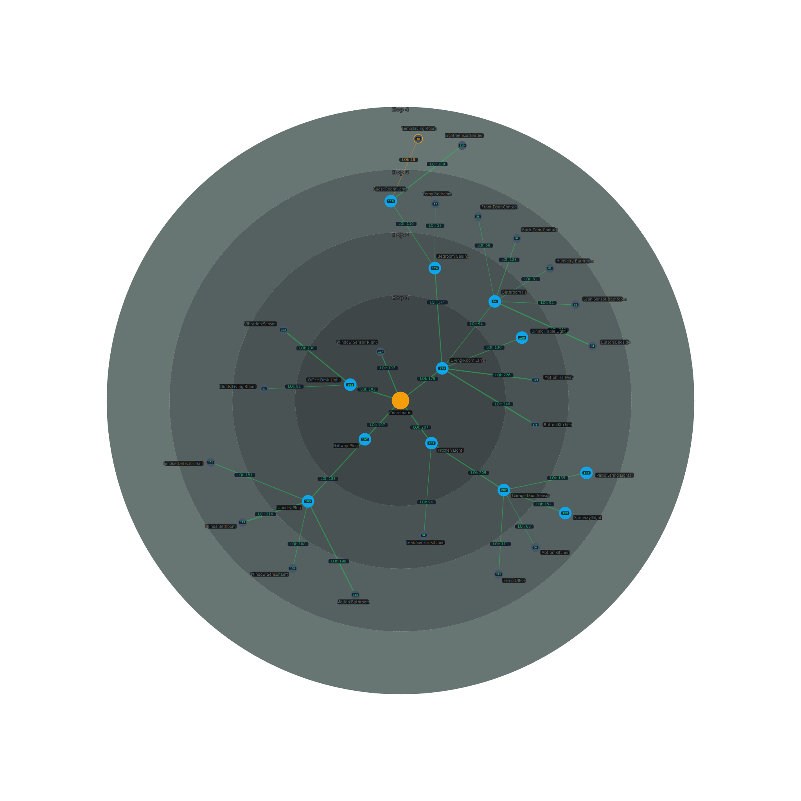

# Zigporter HACS Integration

<p align="center">
  
</p>

<p align="center">
  <a href="https://hacs.xyz"></a>
  <a href="https://github.com/nordstad/zigporter-hacs/releases"></a>
  <a href="https://github.com/nordstad/zigporter-hacs/actions/workflows/validate.yml"></a>
  <a href="https://github.com/nordstad/zigporter-hacs/blob/main/LICENSE"></a>
</p>

Zigbee network topology map for Home Assistant. Visualize your mesh network with LQI signal quality indicators, routing paths, and device hierarchy — rendered as a radial SVG directly in your Lovelace dashboard.

Supports both **Zigbee2MQTT** and **ZHA** backends.

<p align="center">
  
</p>

## Features

- **Radial network map** — devices arranged by hop distance from coordinator
- **LQI signal quality** — color-coded links (green/yellow/red) based on link quality
- **Mesh overlay** — toggle to see all raw neighbor links alongside the routing tree
- **Alerts mode** — dim healthy devices, highlight only critical-signal nodes
- **Pan & zoom** — mouse wheel, drag, and pinch-to-zoom with reset button
- **Configurable colors** — custom hop ring colors and opacity
- **Disk-cached** — scan results persisted across restarts, manual refresh only
- **Dual backend** — switch between Zigbee2MQTT and ZHA without reinstalling

## Quick start

1. [Install via HACS](getting-started/installation.md)
2. [Configure the integration](getting-started/configuration.md)
3. Add the card to your dashboard

```yaml
type: custom:zigporter-network-map-card
```

## Related: Zigporter CLI

This HACS integration is the Home Assistant-native companion to [**Zigporter CLI**](https://github.com/nordstad/zigporter) — a terminal tool for migrating ZHA ↔ Z2M, cascade-renaming entities, and exporting network maps.

[CLI Documentation](https://nordstad.github.io/zigporter/) · [Interactive demo](https://nordstad.github.io/zigporter/interactive-demo/)
